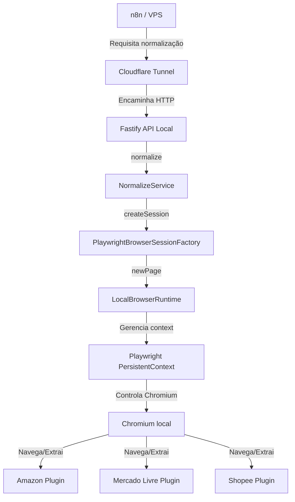

# Arquitetura de Navegador Persistente Local

Este documento descreve a arquitetura simplificada e focada da aplicação, projetada exclusivamente para execução local (Desktop) com persistência nativa gerida pelo próprio Chromium (Playwright).

---

## Diagrama da Arquitetura

---

## Componentes Chave

### 1. `LocalBrowserRuntime`
Gerencia o ciclo de vida do navegador local. É instanciado no boot do Fastify e desliga de forma limpa usando hooks do sistema Node (`SIGTERM`, `SIGINT`, etc.) para evitar travas ou processos zumbis do Chromium.
* **Contexto Único**: Inicializa apenas um único `BrowserContext` persistente. O browser e o contexto nunca são fechados durante a execução da API.
* **Classificação de Abas**: Monitora e divide abas em:
  * **Managed (Gerenciadas)**: Abertas temporariamente pela API para normalizar links (fechadas automaticamente por `page.close()`).
  * **Manual (Manuais)**: Abertas por usuários no endpoint `/browser/open` para autenticação. Nunca são fechadas automaticamente pela API.
* **Segurança de Recursos**: Emite warnings no log caso o número de abas ativas ultrapasse 5, prevenindo memory leaks.

### 2. `BrowserConfig`
Carrega e valida as opções do Playwright a partir do arquivo `.env` (ex: `BROWSER_HEADLESS`, `BROWSER_DATA_DIR`). Cuida da criação automática da árvore de pastas locais para dados e debugging.

### 3. `BrowserHealthService`
Centraliza a telemetria do navegador, capturando uptime, versão do browser, status de execução, diretório físico e quantidade de abas abertas por tipo (managed vs manual). Alimenta as rotas `/health/*` e `/browser/status`.

### 4. `PlaywrightBrowserSessionFactory`
Implementa a abstração `IBrowserSessionFactory`. Centraliza a criação de sessões encapsulando a aba do Playwright sob a interface `INavigatorPage` e delegando a inicialização de novas páginas ao `LocalBrowserRuntime`.

### 5. `AuthenticationRegistry`
Centraliza metadados, URLs iniciais de login e home de cada plataforma (Amazon, Mercado Livre, Shopee) para manter o runtime agnóstico das regras de negócio de marketplaces.

---

## Fluxo de Normalização de URLs

1. O cliente requisita normalização pelo endpoint `POST /normalize`.
2. O `NormalizeService` estima o marketplace e solicita uma aba gerenciada à factory.
3. O resolvedor compósito redireciona a URL de forma agnóstica via HTTP ou navegando no browser (caso utilize scripts JS/redirecionamento dinâmico).
4. O host final do produto é validado e o plugin de marketplace correspondente é acionado.
5. O plugin normaliza o produto (capturando título, imagem, ASIN/ID).
6. O `NormalizeService` publica eventos informando o resultado final e libera a página chamando `session.dispose()`.

---

## Estrutura de Diretórios de Dados (`data/`)

O projeto armazena os dados locais e artefatos de depuração organizados sob o diretório base:

* **`data/browser/`**: Cookies, LocalStorage, IndexedDB e dados de sessão persistentes do Chromium.
* **`data/downloads/`**: Arquivos transferidos temporariamente durante a navegação.
* **`data/screenshots/`**: Capturas de tela para depuração visual.
* **`data/traces/`**: Logs de depuração (Playwright Traces) gerados em falhas.
* **`data/videos/`**: Gravações das interações de navegação.
