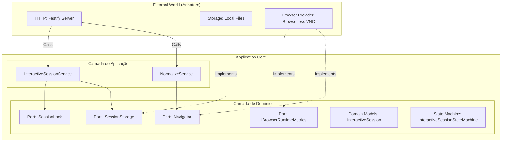

# Visão Geral da Arquitetura

Este documento fornece a visão geral da arquitetura de software do projeto **URL Normalizer**, construído sob os princípios de **Clean Architecture** e **Arquitetura Hexagonal (Ports & Adapters)**.

---

## 🎯 Objetivos do Sistema

O URL Normalizer tem como missão resolver, classificar e normalizar URLs complexas de marketplaces (Amazon, Mercado Livre, Shopee), convertendo-as em links limpos diretos de produto (links canônicos de ASIN/MLB/Item ID) e mitigando barreiras de rede, logins obrigatórios e CAPTCHAs via sessões interativas persistentes.

---

## 🏛️ Princípios Arquiteturais

1. **Independência de Frameworks**: A lógica de domínio e de negócios não depende de bibliotecas externas (como Fastify ou Playwright).
2. **Testabilidade Absoluta**: As regras de negócios e resolvedores são testáveis sem necessidade de inicializar servidores web, bancos de dados ou navegadores físicos (desacoplamento temporal e de IO).
3. **Independência de Agentes Externos**: Interfaces isolam os adaptadores concretos (como a API do Browserless), permitindo a substituição de provedores com zero impacto de negócio.
4. **Isolamento de Camadas (Inversão de Dependências)**: A direção das dependências aponta sempre para o centro (Domínio), nunca para as bordas (Infraestrutura).

---

## 🔷 Arquitetura Hexagonal (Ports & Adapters)

A arquitetura hexagonal separa o núcleo da aplicação (regras de negócio) do mundo externo (transporte, bancos de dados, browsers). O domínio declara **Ports** (interfaces), e a infraestrutura implementa essas portas por meio de **Adapters**.



---

## 📂 Organização dos Módulos

```text
src/
 ├── domain/                  # Domínio: Regras de negócio puras e modelos
 │     ├── models/            # Entidades de dados limpos (ex: InteractiveSession)
 │     ├── ports/             # Interfaces/Contratos (ex: INavigator, IClock)
 │     └── services/          # Serviços puros (ex: InteractiveSessionStateMachine)
 │
 ├── application/             # Aplicação: Casos de uso e orquestração
 │     ├── resolver/          # Motores de resolução leve de afiliados
 │     ├── registry/          # Registros polimórficos de plugins
 │     └── services/          # Orquestradores de fluxo (ex: InteractiveSessionService)
 │
 └── infrastructure/          # Infraestrutura: Implementações físicas externas
       ├── adapters/          # Adaptadores concretos
       │     ├── browser/     # Playwright, Browserless, LeakDetector
       │     ├── marketplaces/# Plugins específicos (Amazon, ML, Shopee)
       │     └── session/     # Persistência em arquivo local e locks
       └── transport/         # Protocolos de transporte
             └── http/        # Servidor Fastify, Rotas HTTP e Schemas
```

---

## 🛡️ Responsabilidade das Camadas

### 1. Domínio (Domain)
* **Responsabilidade**: Contém a essência da aplicação. Modela dados e governa a máquina de estados.
* **Dependências**: Nenhuma. Não importa nada de `/application` ou `/infrastructure`.

### 2. Aplicação (Application)
* **Responsabilidade**: Orquestra os casos de uso. Coordena a chamada a resolvedores leves, chama adaptadores de persistência e expõe os serviços de normalização.
* **Dependências**: Depende apenas de interfaces do Domínio.

### 3. Infraestrutura (Infrastructure)
* **Responsabilidade**: Comunica-se com drivers, arquivos locais e servidores web. Implementa os detalhes físicos necessários ao funcionamento das portas do Domínio.
* **Dependências**: Conhece a camada de Aplicação e Domínio para instanciar a injeção de dependências no Composition Root (`server.ts`).
