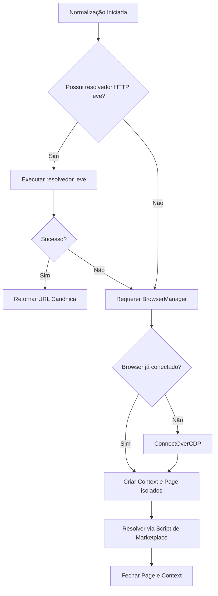
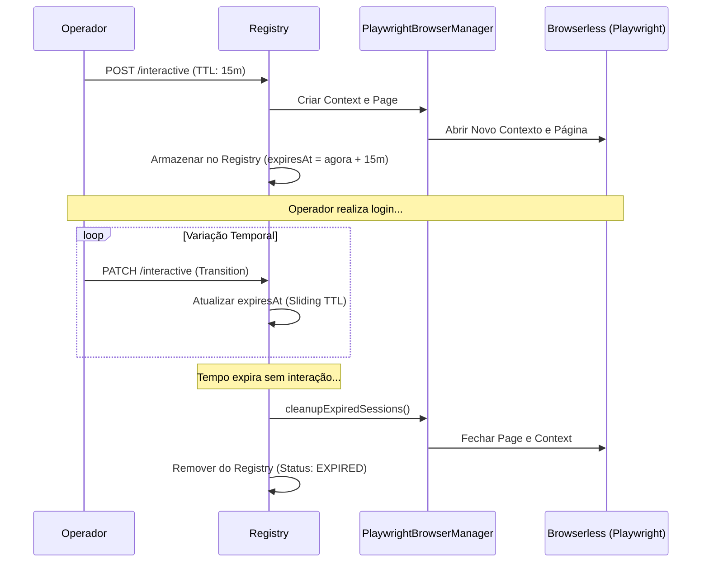

# Ciclo de Vida do Runtime de Navegação

Este documento detalha o ciclo de vida dos recursos do Playwright (Browser, BrowserContext e Page) gerenciados pelo sistema, bem como a expiração por TTL, limpeza e resiliência.

---

## ⏳ Ciclo de Vida dos Recursos

O sistema otimiza o uso do navegador dividindo-o em duas estratégias principais:
1. **Normalização Leve (HTTP/HEAD)**: Evita inicializar o navegador sempre que possível.
2. **Resolução em Navegador (Lazy Connection)**: O navegador remoto (Browserless) é conectado de forma preguiçosa sob demanda na primeira chamada de normalização.

---

## 🏗️ Navegador vs. Contextos vs. Páginas

### 1. Browser (Único e Compartilhado)
* **Tempo de Vida**: Persiste ativo enquanto o processo do servidor estiver rodando.
* **Auto-Cura**: Em caso de falha de conexão física de rede (evento `disconnected`), o `PlaywrightBrowserManager` invalida a conexão interna e a restabelece de forma transparente na próxima chamada.

### 2. BrowserContext e Page
* **Normalização Padrão**: Criados sob demanda a cada requisição para garantir isolamento de cookies e cache. São fechados rigorosamente no bloco `finally` da requisição.
* **Sessão Interativa**:
  * O **BrowserContext** é mantido vivo no registry para sustentar a sessão do operador humano.
  * A **Page** é conectada via WebSocket público para visualização no VNC e DevTools.
  * O ciclo de vida é governado por TTL (Time-To-Live).

---

## 🕰️ TTL, Timeout e Cleanup

### Fluxo de Expiração das Sessões Interativas
1. **Inicialização**: A sessão interativa é criada com um TTL configurável (padrão: 15 minutos).
2. **Atualização**: Cada interação do operador ou transição de estado estende o TTL de forma deslizante (sliding expiration).
3. **Loop de Limpeza**:
   * O sistema realiza a varredura (`cleanupExpiredSessions`) de forma reativa ou via loop cronometrado.
   * Se o tempo atual exceder `expiresAt`, o status transiciona para `EXPIRED`.
   * As instâncias de `Page` e `BrowserContext` são fechadas no Playwright e removidas do `InteractiveSessionRegistry`.

