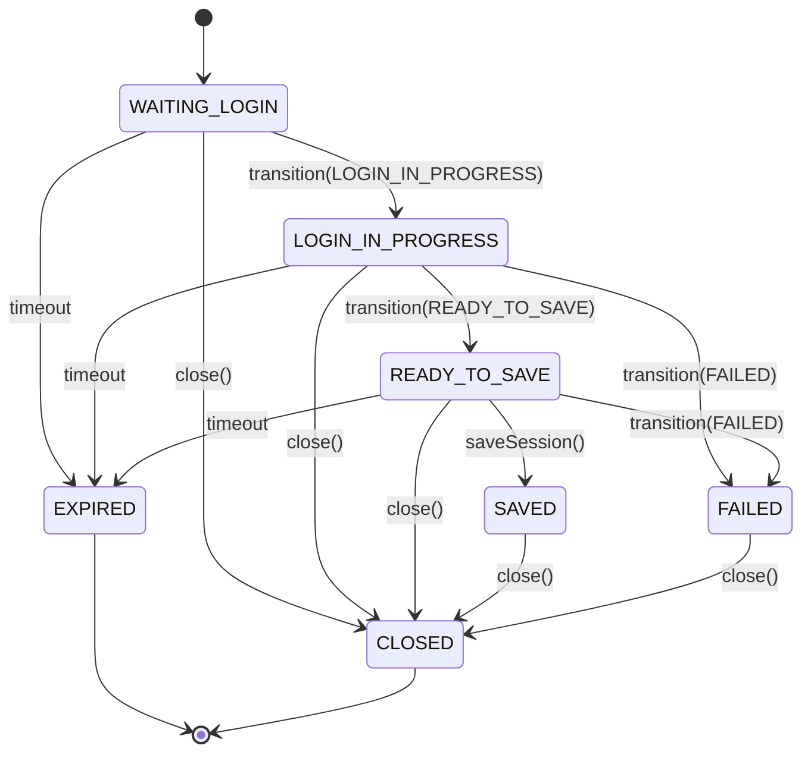

# Máquina de Estados da Sessão Interativa

Este documento especifica a máquina de estados que rege o ciclo de vida das sessões interativas de login dos operadores.

---

## 🗺️ Diagrama de Transição de Estados

---

## 📊 Tabela de Transições Permitidas

| Estado Atual | Próximos Estados Permitidos | Origem/Gatilho |
| :--- | :--- | :--- |
| **`WAITING_LOGIN`** | `LOGIN_IN_PROGRESS`, `EXPIRED`, `CLOSED` | Ação do operador (PATCH) ou Timeout |
| **`LOGIN_IN_PROGRESS`** | `READY_TO_SAVE`, `FAILED`, `EXPIRED`, `CLOSED` | Ação do operador (PATCH) ou Timeout |
| **`READY_TO_SAVE`** | `SAVED`, `FAILED`, `EXPIRED`, `CLOSED` | Chamada ao endpoint `/save` (POST) |
| **`SAVED`** | `CLOSED` | Limpeza final após descarte/encerramento |
| **`FAILED`** | `CLOSED` | Limpeza de recursos pós-falha |
| **`EXPIRED`** | Nenhum (Estado Terminal) | Destruição de recursos pós-timeout |
| **`CLOSED`** | Nenhum (Estado Terminal) | Sessão encerrada |

---

## 🚫 Transições Inválidas e Erros

Qualquer tentativa de realizar uma transição que não esteja mapeada na tabela acima resultará em uma rejeição imediata com o erro **`InvalidStateTransitionError`**, mapeado para **HTTP 400 Bad Request**.

### Exemplos de Transições Rejeitadas:
1. `WAITING_LOGIN` ➔ `SAVED`: Rejeitado. Não é permitido salvar uma sessão sem passar pela classificação de login bem-sucedido.
2. `SAVED` ➔ `READY_TO_SAVE`: Rejeitado. Sessões já salvas são imutáveis e seguem diretamente para o encerramento (`CLOSED`).
3. `EXPIRED` ➔ `READY_TO_SAVE`: Rejeitado. Uma sessão expirada perde suas referências físicas e não pode ser reativada.
