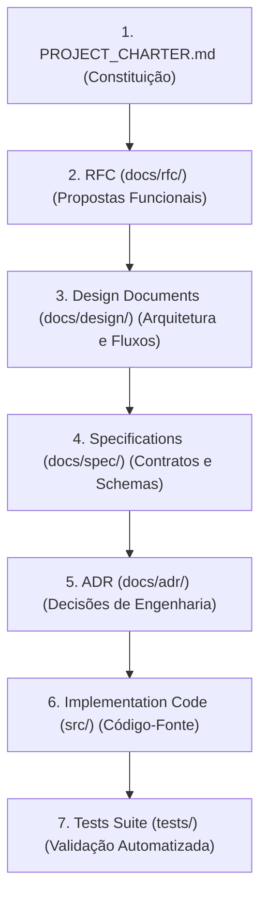

# RFC-000 — Engineering Process

## Status
* **Status**: Proposed
* **Data**: 2026-07-06
* **Autor**: Antigravity Principal Software Architect & Engineering Lead
* **Relação**: Regulamenta operacionalmente o [PROJECT_CHARTER](file:///home/emerson/Documentos/Meus%20Desenvolvimentos/URL-Normalizer%20(Gpt)/PROJECT_CHARTER.md)

---

## 1. Objetivo da RFC

### 1.1 Finalidade
A finalidade deste documento é regulamentar e normatizar o processo oficial de engenharia que regerá todo o ciclo de vida do desenvolvimento do projeto **URL Normalizer**. Este processo visa garantir a previsibilidade operacional, a rastreabilidade histórica e a consistência arquitetural do repositório.

### 1.2 Escopo
Esta RFC estabelece as diretrizes normativas de evolução da base de conhecimento e do código-fonte. Aplica-se obrigatoriamente a qualquer alteração de comportamento, refatoração de estrutura, adição de suporte a novos marketplaces, correção de bugs de impacto funcional ou evolução tecnológica no repositório. O cumprimento deste processo é mandatório para desenvolvedores humanos e agentes de Inteligência Artificial (IAs).

### 1.3 Relação com o Project Charter
O [PROJECT_CHARTER.md](file:///home/emerson/Documentos/Meus%20Desenvolvimentos/URL-Normalizer%20(Gpt)/PROJECT_CHARTER.md) constitui a autoridade máxima de governança do projeto. A presente RFC atua como a legislação processual que operacionaliza os princípios, restrições e objetivos definidos no Charter. Nenhuma regra estabelecida nesta RFC ou em documentos sucessores pode contradizer ou flexibilizar as diretrizes do Project Charter.

---

## 2. Hierarquia Documental

Fica instituída a seguinte precedência normativa para a base de conhecimento permanente e o código-fonte do projeto. Em caso de conflito conceitual ou divergência contratual, os níveis superiores anulam, revogam e prevalecem sobre os níveis inferiores:



### 2.1 Responsabilidades de Cada Nível Documental
1. **PROJECT_CHARTER.md (Nível 1 - Supremo)**: Define a constituição inegociável, restrições de infraestrutura, stack homologado e limites de escopo globais.
2. **Request for Comments (RFC) (Nível 2 - Conceitual)**: Propostas funcionais de evolução, detalhando a justificativa de negócio, comportamento macro esperado e escopo da entrega.
3. **Design Documents (Nível 3 - Estrutural)**: Detalhamento técnico do fluxo interno de dados, mapeamento de novos componentes no ecossistema e modelagem das interações lógicas.
4. **Specifications (Nível 4 - Contratos)**: Contrato rigoroso de payloads (esquemas Zod), rotas HTTP (Fastify), interfaces de domínio (Ports) e tipos comuns de TypeScript.
5. **Architectural Decision Records (ADR) (Nível 5 - Justificativa)**: Registro formal de escolhas de design arquitetural, documentando o contexto, alternativas descartadas, consequências e justificativas técnicas.
6. **Implementation Code (Nível 6 - Executável)**: Código TypeScript limpo e tipado estruturado em Arquitetura Hexagonal, com acoplamento restrito a adaptadores externos.
7. **Tests Suite (Nível 7 - Verificação)**: Conjunto de testes unitários e de integração que garantem a conformidade da implementação em relação aos contratos e especificações.

---

## 3. Fluxo Oficial de Desenvolvimento

Todo e qualquer ciclo de desenvolvimento no projeto deve seguir rigorosamente as etapas descritas a seguir. É expressamente proibido ignorar ou pular etapas do processo:

```
Necessidade
   ↓
[docs/rfc/] Criar RFC
   ↓
Revisão Técnica e de Produto
   ↓
Aprovação da RFC (Status: Approved)
   ↓
[docs/design/] Criar Documento de Design
   ↓
[docs/spec/] Atualizar Especificações de Contratos
   ↓
[docs/adr/] Registrar ADRs (Quando Aplicável)
   ↓
[src/] Início da Implementação Física (TypeScript)
   ↓
[tests/] Desenvolvimento da Suíte de Testes
   ↓
Revisão Arquitetural de PR (Pureza Hexagonal)
   ↓
Merge na Branch Principal (GitHub)
```

### 3.1 Detalhamento das Etapas
1. **Identificação da Necessidade**: Uma nova funcionalidade ou correção é identificada pelos stakeholders do projeto.
2. **Elaboração da RFC**: Um desenvolvedor ou IA cria uma proposta de RFC sob a pasta `docs/rfc/` utilizando numeração sequencial (ex: `docs/rfc/001-normalizacao-v1.md`).
3. **Revisão da RFC**: Discussão conceitual entre os membros do time e IAs de revisão para coletar feedbacks e ajustar o escopo da funcionalidade proposta.
4. **Aprovação da RFC**: O Product Owner (PO) e o Software Architect avaliam a versão final da RFC e alteram seu status para `Approved`.
5. **Elaboração do Documento de Design**: Detalhamento em `docs/design/` descrevendo como o fluxo de execução será integrado à estrutura do projeto (ports, adapters, services).
6. **Atualização da Especificação (Spec)**: Modificação ou criação de arquivos em `docs/spec/` documentando rigorosamente os schemas Zod de validação, payloads JSON e interfaces TypeScript públicos.
7. **Registro de ADRs**: Registro de escolhas arquiteturais específicas de engenharia geradas pela proposta sob a pasta `docs/adr/`.
8. **Implementação do Código**: Desenvolvimento da funcionalidade em TypeScript no diretório `src/`. **A implementação física do código de produção não pode ser iniciada antes que as etapas 1 a 7 estejam concluídas e aprovadas.**
9. **Criação de Testes**: Escrita de testes sob o diretório `tests/` para assegurar o funcionamento dos contratos e lógica do domínio de forma isolada e integrada.
10. **Revisão Arquitetural e de Qualidade**: Processo de auditoria em Pull Requests para verificar a total separação de conceitos (domínio puro) e checagem de tipos estritos do TypeScript.
11. **Merge**: Conclusão do ciclo com a integração das ramificações de código à branch principal do repositório no GitHub.

---

## 4. Critérios de Aprovação

### 4.1 Quando uma RFC é Considerada Aprovada?
Uma RFC atinge o status de `Approved` quando satisfaz cumulativamente:
1. Resolução e documentação de todas as dúvidas arquiteturais e funcionais identificadas na fase de revisão.
2. Alinhamento conceitual com os limites de escopo e visão estratégica do projeto.
3. Assinatura formal de aceitação técnica do Software Architect e de negócio do Product Owner.

### 4.2 Quando a Implementação Física Pode Começar?
O início da escrita de código de produção e de testes só está autorizado após:
1. A RFC relacionada estar com o status definido como `Approved`.
2. O Documento de Design técnico estar validado sem conflitos de interações de dados.
3. As modificações de contratos públicos estarem salvas e consolidadas na pasta `docs/spec/`.
4. Todas as ADRs técnicas decorrentes estarem documentadas e aprovadas pelo Arquiteto.

---

## 5. Governança Arquitetural

Ficam instituídas as seguintes diretrizes permanentes de governança no desenvolvimento do projeto:
* **Nenhuma Implementação Sem RFC**: Qualquer trecho de código inserido no projeto que não possua correspondência com uma RFC aprovada será tratado como violação de processo e removido.
* **Nenhuma Mudança Arquitetural Sem ADR**: Escolhas estruturais (como alterações no ciclo de vida de conexões do Playwright, formas de gerenciar dependências ou injeção) exigem obrigatoriamente a aprovação de uma ADR.
* **Nenhuma Alteração Contratual Sem Atualização da Spec**: Contratos públicos de entrada e saída de dados (schemas de validação e interfaces) não podem ser alterados diretamente no código sem prévia atualização dos documentos em `docs/spec/`.
* **Subordinação Arquitetural Absoluta**: Os princípios declarados no [PROJECT_CHARTER.md](file:///home/emerson/Documentos/Meus%20Desenvolvimentos/URL-Normalizer%20(Gpt)/PROJECT_CHARTER.md) são inegociáveis. Violações de pureza de domínio, acoplamento direto com Fastify/Playwright no núcleo de negócios ou uso de estruturas condicionais centrais para resolução de marketplaces acarretam rejeição sumária do código.
* **Precedência de Arquitetura em Revisões**: O foco primário de qualquer revisão técnica de código deve ser a verificação do isolamento hexagonal de camadas e aplicação de SOLID, antes de avaliar estilo de código ou micro-otimizações.

---

## 6. Processo de Revisão

O ciclo de auditoria de alterações do projeto é segmentado nas seguintes disciplinas obrigatórias:
* **Revisão Documental**: Verificação de consistência e rastreabilidade entre os arquivos da PKB. Garante que os novos documentos de design e especificação estejam referenciados e atualizados.
* **Revisão Arquitetural (Auditoria Hexagonal)**: Checagem minuciosa para garantir que:
  * O código localizado na pasta de Domínio não possua referências ou importações do Playwright, Fastify ou adaptadores de banco de dados.
  * O acoplamento ocorra unicamente por injeção de dependências via Ports.
  * Plugins de marketplaces utilizem a seleção dinâmica e polimórfica baseada no contrato `canHandle`, rejeitando a escrita de instruções condicionais estáticas (`switch` ou `if`).
* **Revisão Técnica**: Análise de conformidade de tipagem estrita do compilador TypeScript (`strict: true`), robustez nos tratamentos de exceções, ausência de vazamentos de recursos (Pages ociosas) e legibilidade do código.
* **Critérios de Aceite para Merge**:
  1. Compilação bem-sucedida sem flags de bypass de tipagem (`any` ou type assertion injustificada).
  2. Cobertura de testes respeitando o limite mínimo de 80% do código modificado.
  3. Conformidade absoluta atestada em relação aos documentos de design, especificações e ADRs associadas.

---

## 7. Processo de Versionamento e Histórico

A evolução de documentos de governança e técnicos deve seguir os padrões abaixo:
* **Documentos Estáticos de Governança (RFCs e ADRs)**:
  * Uma vez aprovados e integrados, estes documentos tornam-se registros históricos imutáveis do projeto.
  * Se uma decisão arquitetural registrada em uma ADR precisar ser alterada, uma nova ADR com status `Proposed` deve ser gerada, referenciando explicitamente a ADR anterior. Se aprovada, a ADR antiga deve ser atualizada contendo o status `Superseded` e o link da nova ADR substituta.
* **Documentos Dinâmicos de Projeto (Specs e Design Docs)**:
  * Os documentos sob `docs/spec/` e `docs/design/` são documentos vivos que devem ser modificados à medida que o sistema evolui.
  * As alterações devem preservar o histórico por meio de mensagens de commit claras e concisas no Git (ex: `docs: update POST /normalize spec payload for ML product ID`).

---

## 8. Papéis e Responsabilidades

* **Product Owner (PO)**: Responsável pela priorização de requisitos de negócio, aprovação e controle de escopo das RFCs funcionais.
* **Software Architect**: Responsável por manter a integridade conceitual do sistema, validar o design de componentes, aprovar as ADRs e inspecionar a pureza hexagonal e acoplamento.
* **Desenvolvedor**: Responsável pela implementação de código de produção tipado TypeScript em conformidade com as especificações e design aprovados, além de garantir a cobertura de testes correspondente.
* **Revisor**: Engenheiro ou IA responsável por inspecionar a legibilidade técnica, conformidade arquitetural e robustez das propostas e do código.
* **IA de Implementação**: Agente focado em escrever os arquivos lógicos em `src/` em estrito alinhamento com as diretrizes do Documento de Design e especificações, sem permissão para tomar decisões de arquitetura de forma autônoma.
* **IA de Revisão / Auditoria**: Agente configurado para analisar propostas e PRs, gerando relatórios de conformidade e validando se o Processo de Engenharia foi rigorosamente obedecido.

---

## 9. Integração entre IAs (IA Governance)

Dado que o projeto URL Normalizer prevê o desenvolvimento colaborativo assíncrono mediado por múltiplas instâncias e marcas de Inteligência Artificial, determinam-se as seguintes regras de governança:
* **Princípio da Leitura Prévia da PKB**: Qualquer agente de IA que assumir uma tarefa do projeto deve iniciar obrigatoriamente pela leitura dos arquivos conceituais básicos (`00` a `09`) e do `PROJECT_CHARTER.md` para nivelamento de contexto operacional.
* **Proibição de Decisões Implícitas**: Caso uma IA identifique ambiguidades de design ou lacunas nos contratos técnicos, ela está expressamente proibida de tomar decisões implícitas. A IA deve registrar a questão arquitetural como pendente e solicitar feedback ao arquiteto humano antes de prosseguir com a implementação de código.
* **Normatividade Linguística**: Toda a documentação gerada por IAs deve ser escrita utilizando linguagem normativa, imperativa e de alta clareza estrutural, evitando subjetividades e facilitando a intelecção automatizada por outras IAs que venham a operar no projeto.

---

## 10. Critérios de Qualidade do Processo

A adesão ao Processo de Engenharia oficial será mensurada com base nos seguintes indicadores:
* **Rastreabilidade Documental (Traceability Rate)**: Percentual de commits de código-fonte que fazem referência explícita ao ID da RFC e à ADR relacionada (meta de 100%).
* **Bypass Rate de Etapas de Governança**: Quantidade de implementações de código de produção submetidas sem a prévia consolidação técnica na pasta `docs/spec/` (meta de 0%).
* **Conformidade Hexagonal**: Quantidade de incidentes de acoplamento direto com tecnologias de infraestrutura (Fastify, Playwright) detectados no Domínio (meta de 0%).
* **Taxa de Fechamento de Recursos**: Percentual de fechamento controlado de páginas do Playwright sob concorrência e testes integrados (meta de 100%).
